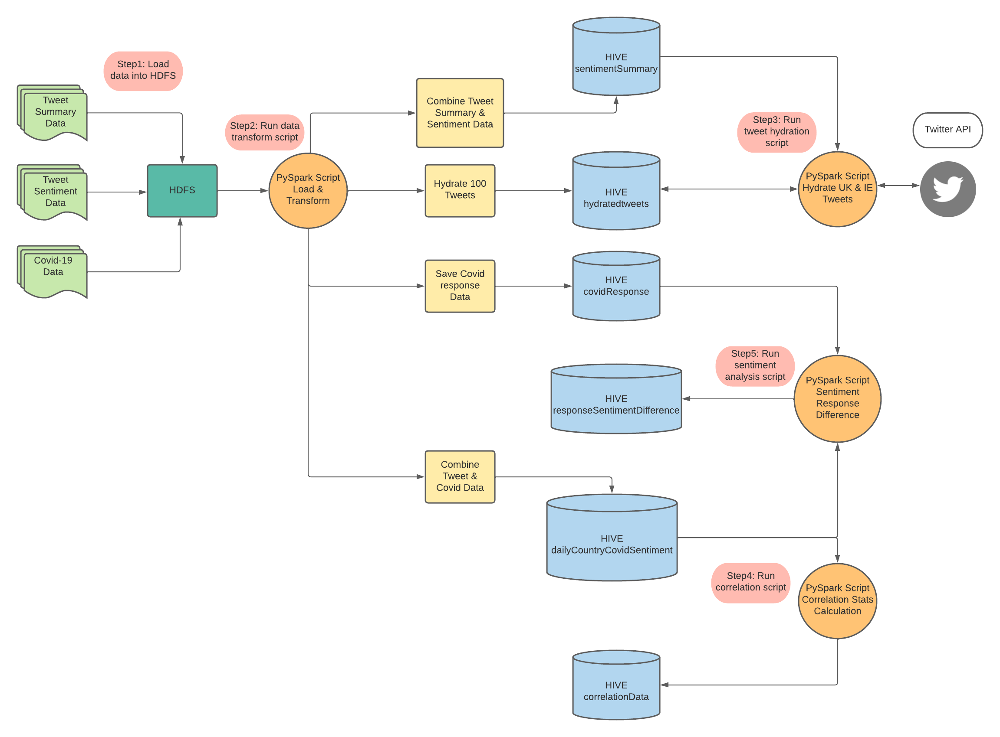

<h1>Big Data Twitter Sentiment Analysis of Coronavirus</h1>

This repository contains the code I wrote for my AI Big Data Post Graduate coursework.  

I chose to focus my project on twitter data of the coronavirus to better understand people's sentiment towards the pandemic.

<h2>Technical Overview</h2>

The image below shows the high level technical solution for this project.

<h2>Demo</h2>

<video src='https://www.youtube.com/watch?v=VGzKFkUWID4' width=180></video>

<h2>Data Sources</h2>

The data I used for this coursework was:

Twitter Data - https://github.com/lopezbec/COVID19_Tweets_Dataset_2020

ECDC Covid Data - https://www.ecdc.europa.eu/en/covid-19/data